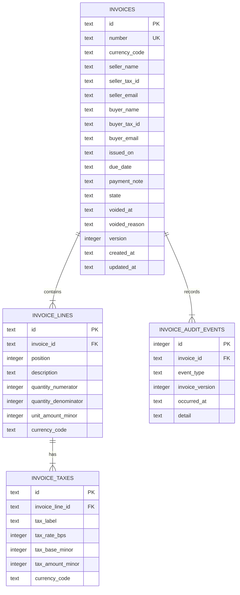
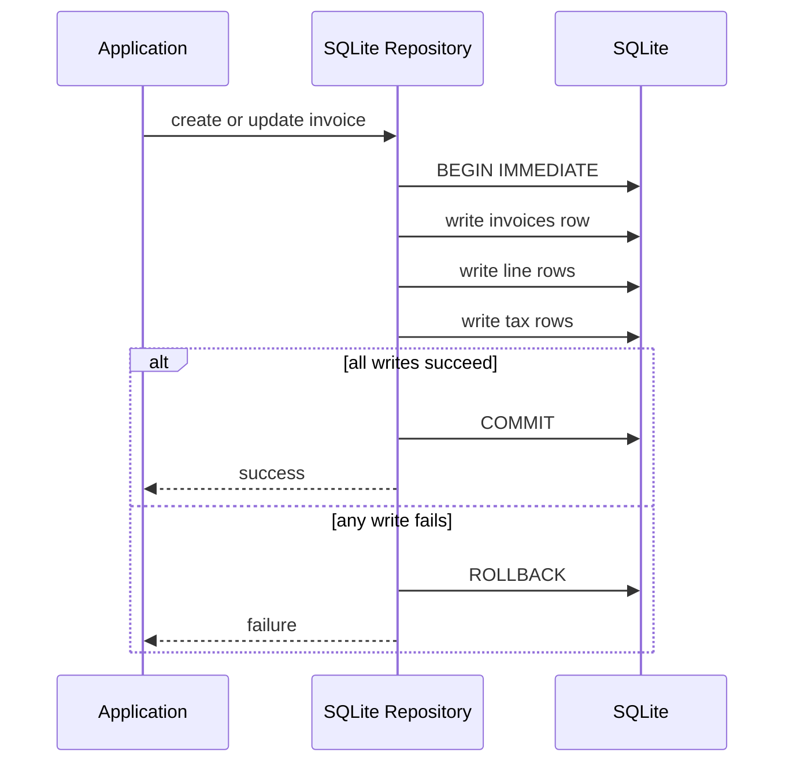
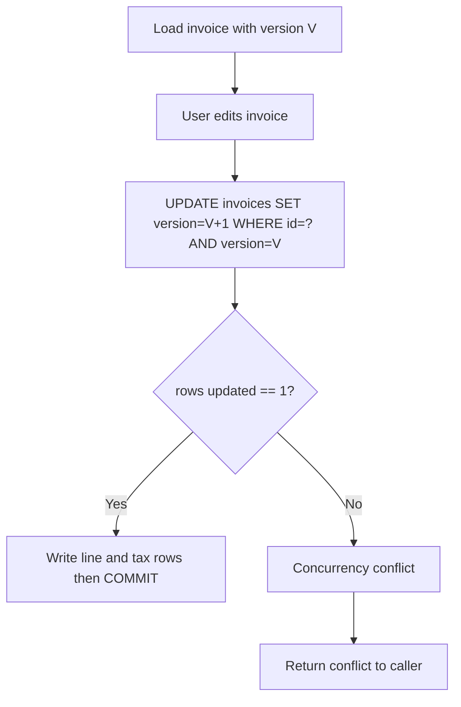

# Persistence Design

## Scope
This document defines the persistence design for local invoice storage before adapter implementation. It specifies entities, relationships, transaction boundaries, and optimistic concurrency behavior.

## Storage model
- Engine: SQLite
- Data shape: normalized relational tables
- Source of truth: relational records with an explicit startup connection contract
- Write mode: transactions opened with `BEGIN IMMEDIATE` for write flows
- Precision: never use floating-point for money values

## Local store lifecycle
- Application storage is represented by a directory plus one database file name.
- The default database file name is `plain-invoice.sqlite`.
- The lifecycle object creates the storage directory before opening SQLite.
- The lifecycle object owns the JDBC connection and closes it on application shutdown.
- The lifecycle object configures and validates the SQLite connection before repository bootstrap.
- Repository adapters receive an already opened connection and remain focused on invoice persistence.
- Startup failures are reported as explicit `IllegalStateException` failures for directory setup or database open errors.

## SQLite connection contract
The local store startup sequence must apply and verify these connection requirements before any schema bootstrap or repository write:

| Setting | Required value | Reason |
|---|---|---|
| `PRAGMA foreign_keys` | `ON` | parent-child integrity must be enforced on every connection |
| `PRAGMA journal_mode` | `DELETE` | keep the default rollback journal model explicit and avoid WAL sidecars, checkpoint work, and restore ambiguity for a single-process desktop store |
| `PRAGMA busy_timeout` | `5000` ms | bound lock waits so `BEGIN IMMEDIATE` and backup/open races fail predictably instead of spinning indefinitely |
| `PRAGMA quick_check(1)` | `ok` | reject corrupt or non-SQLite files during startup before repository work begins |

Contract notes:
- WAL is not used in v1. The store must remain a single database file plus transient rollback journal behavior managed by SQLite.
- Because WAL is disabled, the application does not manage checkpoints and does not rely on `-wal` or `-shm` sidecar files being preserved during backup or restore.
- Backup/restore flows operate on the main database file and SQLite backup API output; no extra checkpoint step is required before creating a backup archive.
- Any failure to apply or verify the connection contract is a startup failure and must abort store open with `IllegalStateException`.

## Backup archives
- Backups are produced from the configured local `StoreHome`.
- The command writes a SQLite-safe database copy through the SQLite backup API exposed by the JDBC driver, not by copying a live database file directly.
- Each backup artifact is a timestamped zip archive named `plain-invoice-YYYYMMDDTHHMMSSZ.zip`.
- If the same timestamp already exists, the command appends a numeric suffix such as `-2`.
- Each archive contains:
  - `plain-invoice.sqlite`, the copied database snapshot
  - `metadata.properties`, restore compatibility metadata
- Metadata fields:
  - `format=plain-invoice-backup-v1`
  - `created_at=<ISO-8601 instant>`
  - `database_name=<configured database file name>`
  - `schema_version=1`
- Restore flows must check `format` and `schema_version` before replacing or importing a local store.

## Local settings
- Seller profile and invoice defaults live in the application/settings slice as immutable records.
- The settings slice exposes a repository port for loading and saving one local settings snapshot.
- Storage adapters may persist that snapshot in SQLite or another local format, but domain objects must not depend on storage rows.
- Settings should include seller profile, default currency, default payment terms, default invoice number series, and optional tax presets.
- New-invoice flows should consume settings through application contracts instead of hidden JavaFX control defaults.

## Invariant ownership
Persistence uses three levels of invariant ownership. The owning level performs the primary check; lower levels only add cheap safety nets where SQLite can express the rule locally.

| Invariant | Owner | SQLite role |
|---|---|---|
| Currency code shape, money normalization, quantity validity, percentage validity | Domain | none |
| Party, payment terms, line item, invoice lifecycle transitions | Domain | state/date shape checks only |
| Invoice lines use one invoice currency | Domain, then repository boundary | child currency triggers reject drift from header/line snapshots |
| Row graph consistency when rehydrating an invoice | Repository boundary | foreign keys and uniqueness constraints |
| One persisted tax row per current line mapping | Repository boundary | `UNIQUE (invoice_line_id, tax_label)` only |
| Optimistic concurrency and conflict reporting | Repository boundary | `version` column is data, not the rule |
| Draft-only persisted invoice edits | Repository boundary | no trigger until lifecycle transition commands are separated from edits |
| Aggregate write atomicity | Repository boundary | SQLite transaction engine |
| Primary keys, parent-child references, unique invoice number, unique line position, unique tax label | Database safety net | primary key, foreign key, and unique constraints |
| Local row shapes: valid state code, ISO date text shape, void timestamp presence, positive denominator, non-negative stored minor amounts/rates | Database safety net | `CHECK` constraints |
| Audit append-only behavior | Database safety net | update/delete triggers |

Rules that cross rows or tables stay out of `CHECK` constraints. SQLite `CHECK` constraints are for local row rules; cross-table consistency belongs in repository logic or explicit triggers when a later issue decides a database safety net is worth the migration cost.

## Entity model

### invoices
Purpose: invoice aggregate root header.

Columns:
- `id` TEXT PRIMARY KEY
- `number` TEXT NOT NULL UNIQUE
- `currency_code` TEXT NOT NULL
- `seller_name` TEXT NOT NULL
- `seller_tax_id` TEXT
- `seller_email` TEXT
- `buyer_name` TEXT NOT NULL
- `buyer_tax_id` TEXT
- `buyer_email` TEXT
- `issued_on` TEXT NOT NULL
- `due_date` TEXT NOT NULL
- `payment_note` TEXT
- `state` TEXT NOT NULL
- `voided_at` TEXT
- `voided_reason` TEXT
- `version` INTEGER NOT NULL
- `created_at` TEXT NOT NULL
- `updated_at` TEXT NOT NULL

Constraints:
- `state IN ('DRAFT', 'ISSUED', 'SENT', 'PAID', 'VOID')`
- `issued_on` and `due_date` must match `YYYY-MM-DD` (`GLOB` checks)
- if `state='VOID'`, `voided_at` must be non-null

Rules:
- `version` starts at `1` and increments on each successful update.

### invoice_lines
Purpose: line items under invoice.

Columns:
- `id` TEXT PRIMARY KEY
- `invoice_id` TEXT NOT NULL
- `position` INTEGER NOT NULL
- `description` TEXT NOT NULL
- `quantity_numerator` INTEGER NOT NULL
- `quantity_denominator` INTEGER NOT NULL
- `unit_amount_minor` INTEGER NOT NULL
- `currency_code` TEXT NOT NULL

Foreign keys:
- `invoice_id` -> `invoices(id)` ON DELETE CASCADE

Constraints:
- unique (`invoice_id`, `position`)
- `quantity_denominator > 0`
- `unit_amount_minor >= 0`

Rules:
- quantity is exact rational (`numerator/denominator`) to avoid TEXT parsing and floating drift.
- line totals are not generated by SQLite; they are derived by the domain monetary policy to avoid integer truncation.
- tax snapshot amounts persist domain-computed minor-unit values.

### invoice_taxes
Purpose: persisted tax breakdown snapshots per line.

Columns:
- `id` TEXT PRIMARY KEY
- `invoice_line_id` TEXT NOT NULL
- `tax_label` TEXT NOT NULL
- `tax_rate_bps` INTEGER NOT NULL
- `tax_base_minor` INTEGER NOT NULL
- `tax_amount_minor` INTEGER NOT NULL
- `currency_code` TEXT NOT NULL

Foreign keys:
- `invoice_line_id` -> `invoice_lines(id)` ON DELETE CASCADE

Constraints:
- unique (`invoice_line_id`, `tax_label`)
- `tax_rate_bps >= 0`

Rules:
- multiple tax components per line are supported (`VAT`, `WHT`, etc).

### invoice_audit_events
Purpose: append-only record of invoice persistence mutations and repository conflict outcomes.

Columns:
- `id` INTEGER PRIMARY KEY AUTOINCREMENT
- `invoice_id` TEXT NOT NULL
- `event_type` TEXT NOT NULL
- `invoice_version` INTEGER NOT NULL
- `operation_id` TEXT NOT NULL
- `actor` TEXT NOT NULL
- `source` TEXT NOT NULL
- `occurred_at` TEXT NOT NULL
- `detail` TEXT NOT NULL

Foreign keys:
- `invoice_id` -> `invoices(id)` ON DELETE RESTRICT

Rules:
- each repository `save` attempt generates one `operation_id`; every audit row emitted by that attempt uses the same correlation value.
- until UI identity exists, repository-written audit rows use internal metadata: `actor='system'` and `source='sqlite-repo'`.
- create/update audit rows are written in the same transaction as the invoice mutation.
- stale-version conflict rows are appended after rollback so the conflict is still observable.
- conflict audit rows use a separate transaction boundary: rollback the failed write transaction first, then open a new `BEGIN IMMEDIATE` transaction for the conflict audit insert, then commit or roll back that audit transaction independently.
- update/delete triggers prevent normal mutation of audit rows.

## Mermaid ER model

## Currency consistency
- `invoices.currency_code` is authoritative.
- Persisted invoices are strictly single-currency.
- `invoice_lines.currency_code` and `invoice_taxes.currency_code` remain stored snapshots, not independent currency state.
- Repository mapping validates row currency while rehydrating invoices.
- SQLite triggers reject line currency drift from the invoice header and tax currency drift from the parent line.
- Do not use child currency columns to infer invoice currency; always use `invoices.currency_code`.

## Transaction boundaries

### create invoice
Single write transaction:
1. `BEGIN IMMEDIATE`
2. Insert `invoices` with `version=1`
3. Insert `invoice_lines`
4. Insert `invoice_taxes`
5. Insert append-only `invoice_audit_events` row
6. `COMMIT`

Rollback behavior:
- Any failure triggers `ROLLBACK` and aborts aggregate write.

### update invoice
Single write transaction:
1. `BEGIN IMMEDIATE`
2. Check the current row for the expected `id` and `version`
3. Reject the write if the current row exists and `state <> 'DRAFT'`
4. Update `invoices` with optimistic concurrency check (`WHERE id=? AND version=?`)
5. Replace child rows (`invoice_lines`, `invoice_taxes`) in same transaction
6. Increment version (`version = version + 1`) on successful header update
7. Insert append-only `invoice_audit_events` row
8. `COMMIT`

Rollback behavior:
- Any failure triggers `ROLLBACK` and aborts aggregate update.

Trigger decision:
- Do not add a draft-only update trigger in schema v1 yet.
- The repository owns draft-only edit enforcement because the database cannot currently distinguish an invoice edit from a future explicit lifecycle transition command.
- Revisit a trigger only after lifecycle persistence commands are separated from general edit persistence.

### load/list invoices
Read flows:
- `load(id)` reads invoice header + child rows as one logical snapshot.
- `list()` reads headers ordered by `issued_on` desc, `number` desc.

## Mermaid write-flow

## Optimistic concurrency

Conflict detection:
- Update statement must match both `id` and current `version`.
- If affected row count is `0`, treat as concurrency conflict.

Conflict handling:
- Repository raises a domain-facing concurrency conflict error.
- Caller decides retry, refresh, or user resolution flow.

## Mermaid optimistic-concurrency flow

## Indexing strategy
- unique index on `invoices(number)`
- index on `invoices(state)`
- index on `invoices(created_at)` for local maintenance/history scans ordered or filtered by creation time
- index on `invoices(updated_at)` for recent-change UI lists and maintenance queries ordered or filtered by last update time
- partial index on unpaid-active set:
  - `CREATE INDEX idx_invoices_unpaid_due ON invoices(due_date) WHERE state NOT IN ('PAID','VOID')`
- index on `invoice_lines(invoice_id)`
- unique index on `invoice_lines(invoice_id, position)`
- index on `invoice_taxes(invoice_line_id)`
- unique index on `invoice_taxes(invoice_line_id, tax_label)`
- index on `invoice_audit_events(invoice_id)`

## Migration implications
- Schema constraints should be defined in initial `CREATE TABLE` statements.
- SQLite `ALTER TABLE` support is limited, so late constraint changes are expensive (copy-table migration pattern).

## Research references
- SQLite online backup API: https://www.sqlite.org/backup.html
- SQLite `VACUUM INTO` behavior and limitations: https://sqlite.org/lang_vacuum.html
- SQLite foreign keys: https://www.sqlite.org/foreignkeys.html
- SQLite transactions (`BEGIN IMMEDIATE`): https://www.sqlite.org/lang_transaction.html
- SQLite isolation behavior: https://www.sqlite.org/isolation.html
- SQLite dynamic typing: https://www.sqlite.org/datatype3.html
- SQLite floating-point caveats: https://sqlite.org/floatingpoint.html
- SQLite pragmas (`foreign_keys` default): https://www.sqlite.org/pragma.html
- SQLite CREATE TABLE constraints: https://www.sqlite.org/lang_createtable.html
- SQLite ALTER TABLE limitations: https://www.sqlite.org/lang_altertable.html
- SQLite generated columns: https://www.sqlite.org/gencol.html
- SQLite partial indexes: https://www.sqlite.org/partialindex.html
- Optimistic Offline Lock: https://martinfowler.com/eaaCatalog/optimisticOfflineLock.html

## Out of scope for this issue
- Concrete SQL migration scripts (issue #24)
- JDBC/SQLite repository adapter implementation (issue #20)
