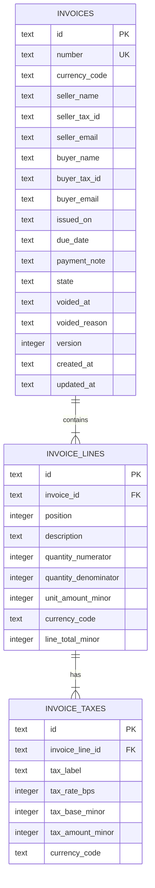
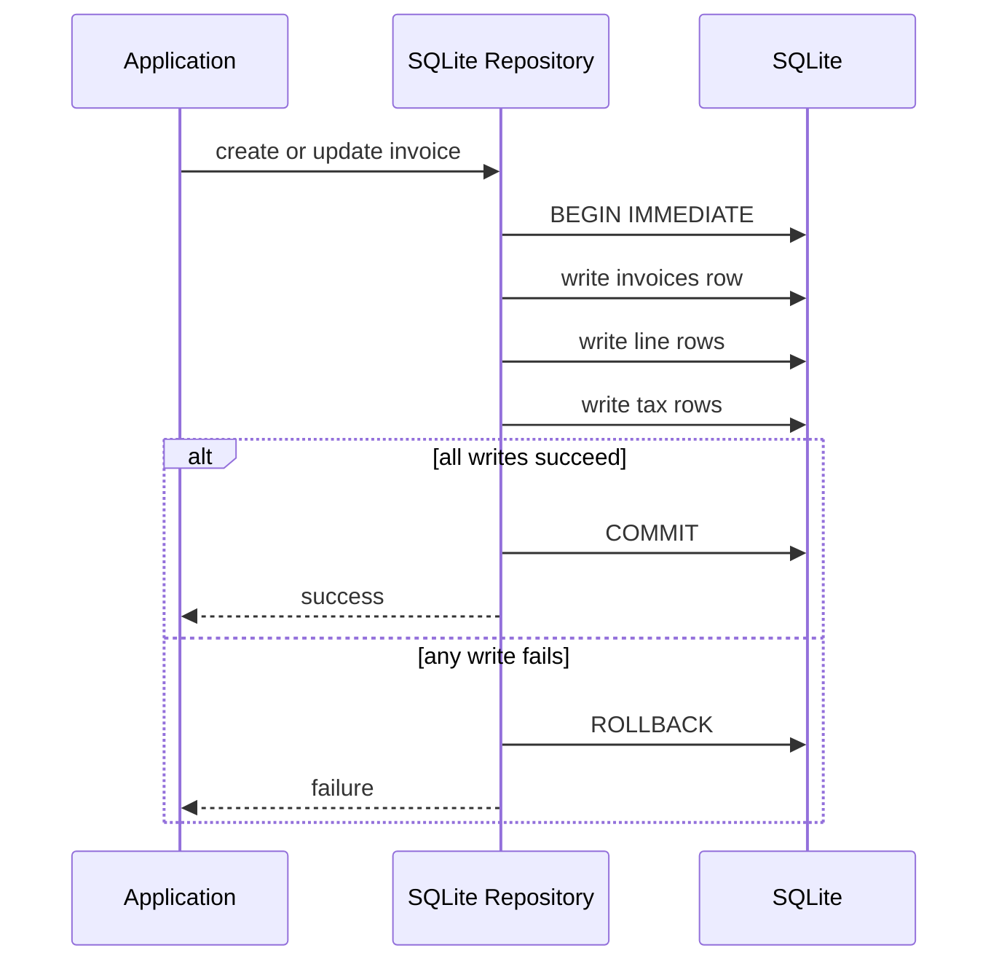
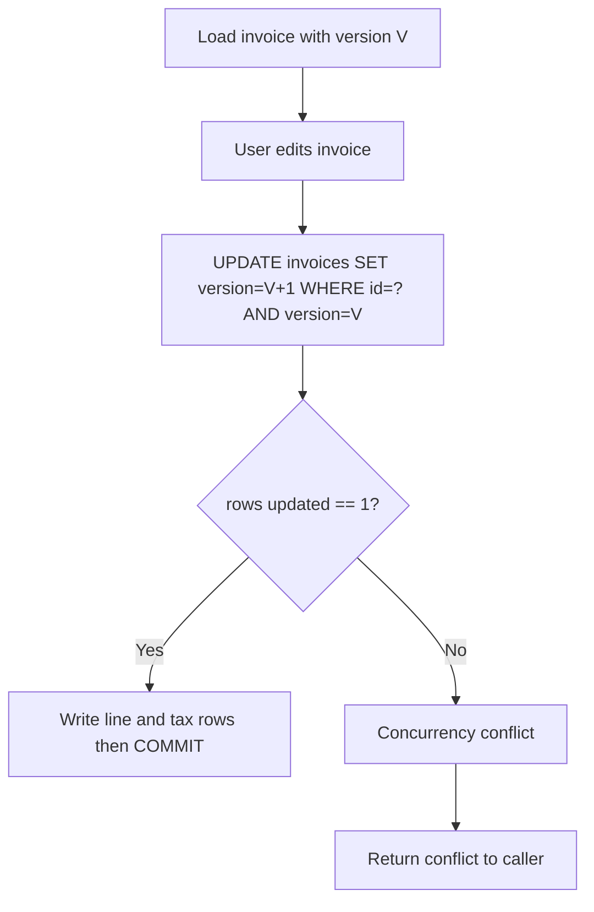

# Persistence Design

## Scope
This document defines the persistence design for local invoice storage before adapter implementation. It specifies entities, relationships, transaction boundaries, and optimistic concurrency behavior.

## Storage model
- Engine: SQLite
- Data shape: normalized relational tables
- Source of truth: relational records with foreign keys enabled on each connection (`PRAGMA foreign_keys = ON`)
- Write mode: transactions opened with `BEGIN IMMEDIATE` for write flows
- Precision: never use floating-point for money values

## Local store lifecycle
- Application storage is represented by a directory plus one database file name.
- The default database file name is `plain-invoice.sqlite`.
- The lifecycle object creates the storage directory before opening SQLite.
- The lifecycle object owns the JDBC connection and closes it on application shutdown.
- Repository adapters receive an already opened connection and remain focused on invoice persistence.
- Startup failures are reported as explicit `IllegalStateException` failures for directory setup or database open errors.

## Entity model

### invoices
Purpose: invoice aggregate root header.

Columns:
- `id` TEXT PRIMARY KEY
- `number` TEXT NOT NULL UNIQUE
- `currency_code` TEXT NOT NULL
- `seller_name` TEXT NOT NULL
- `seller_tax_id` TEXT
- `seller_email` TEXT
- `buyer_name` TEXT NOT NULL
- `buyer_tax_id` TEXT
- `buyer_email` TEXT
- `issued_on` TEXT NOT NULL
- `due_date` TEXT NOT NULL
- `payment_note` TEXT
- `state` TEXT NOT NULL
- `voided_at` TEXT
- `voided_reason` TEXT
- `version` INTEGER NOT NULL
- `created_at` TEXT NOT NULL
- `updated_at` TEXT NOT NULL

Constraints:
- `state IN ('DRAFT', 'ISSUED', 'SENT', 'PAID', 'VOID')`
- `issued_on` and `due_date` must match `YYYY-MM-DD` (`GLOB` checks)
- if `state='VOID'`, `voided_at` must be non-null

Rules:
- `version` starts at `1` and increments on each successful update.

### invoice_lines
Purpose: line items under invoice.

Columns:
- `id` TEXT PRIMARY KEY
- `invoice_id` TEXT NOT NULL
- `position` INTEGER NOT NULL
- `description` TEXT NOT NULL
- `quantity_numerator` INTEGER NOT NULL
- `quantity_denominator` INTEGER NOT NULL
- `unit_amount_minor` INTEGER NOT NULL
- `currency_code` TEXT NOT NULL
- `line_total_minor` INTEGER GENERATED ALWAYS AS ((unit_amount_minor * quantity_numerator) / quantity_denominator) STORED

Foreign keys:
- `invoice_id` -> `invoices(id)` ON DELETE CASCADE

Constraints:
- unique (`invoice_id`, `position`)
- `quantity_denominator > 0`
- `unit_amount_minor >= 0`

Rules:
- quantity is exact rational (`numerator/denominator`) to avoid TEXT parsing and floating drift.

### invoice_taxes
Purpose: persisted tax breakdown snapshots per line.

Columns:
- `id` TEXT PRIMARY KEY
- `invoice_line_id` TEXT NOT NULL
- `tax_label` TEXT NOT NULL
- `tax_rate_bps` INTEGER NOT NULL
- `tax_base_minor` INTEGER NOT NULL
- `tax_amount_minor` INTEGER NOT NULL
- `currency_code` TEXT NOT NULL

Foreign keys:
- `invoice_line_id` -> `invoice_lines(id)` ON DELETE CASCADE

Constraints:
- unique (`invoice_line_id`, `tax_label`)
- `tax_rate_bps >= 0`

Rules:
- multiple tax components per line are supported (`VAT`, `WHT`, etc).

## Mermaid ER model

## Currency consistency
- `invoices.currency_code` is authoritative.
- `invoice_lines.currency_code` and `invoice_taxes.currency_code` must match the invoice header currency.
- Enforce in repository layer and (where feasible) via schema-level checks/triggers in migration.

## Transaction boundaries

### create invoice
Single write transaction:
1. `BEGIN IMMEDIATE`
2. Insert `invoices` with `version=1`
3. Insert `invoice_lines`
4. Insert `invoice_taxes`
5. `COMMIT`

Rollback behavior:
- Any failure triggers `ROLLBACK` and aborts aggregate write.

### update invoice
Single write transaction:
1. `BEGIN IMMEDIATE`
2. Update `invoices` with optimistic concurrency check (`WHERE id=? AND version=?`)
3. Replace child rows (`invoice_lines`, `invoice_taxes`) in same transaction
4. Increment version (`version = version + 1`) on successful header update
5. `COMMIT`

Rollback behavior:
- Any failure triggers `ROLLBACK` and aborts aggregate update.

### load/list invoices
Read flows:
- `load(id)` reads invoice header + child rows as one logical snapshot.
- `list()` reads headers ordered by `issued_on` desc, `number` desc.

## Mermaid write-flow

## Optimistic concurrency

Conflict detection:
- Update statement must match both `id` and current `version`.
- If affected row count is `0`, treat as concurrency conflict.

Conflict handling:
- Repository raises a domain-facing concurrency conflict error.
- Caller decides retry, refresh, or user resolution flow.

## Mermaid optimistic-concurrency flow

## Indexing strategy
- unique index on `invoices(number)`
- index on `invoices(state)`
- partial index on unpaid-active set:
  - `CREATE INDEX idx_invoices_unpaid_due ON invoices(due_date) WHERE state NOT IN ('PAID','VOID')`
- index on `invoice_lines(invoice_id)`
- unique index on `invoice_lines(invoice_id, position)`
- index on `invoice_taxes(invoice_line_id)`
- unique index on `invoice_taxes(invoice_line_id, tax_label)`

## Migration implications
- Schema constraints should be defined in initial `CREATE TABLE` statements.
- SQLite `ALTER TABLE` support is limited, so late constraint changes are expensive (copy-table migration pattern).

## Research references
- SQLite foreign keys: https://www.sqlite.org/foreignkeys.html
- SQLite transactions (`BEGIN IMMEDIATE`): https://www.sqlite.org/lang_transaction.html
- SQLite isolation behavior: https://www.sqlite.org/isolation.html
- SQLite dynamic typing: https://www.sqlite.org/datatype3.html
- SQLite floating-point caveats: https://sqlite.org/floatingpoint.html
- SQLite pragmas (`foreign_keys` default): https://www.sqlite.org/pragma.html
- SQLite CREATE TABLE constraints: https://www.sqlite.org/lang_createtable.html
- SQLite ALTER TABLE limitations: https://www.sqlite.org/lang_altertable.html
- SQLite generated columns: https://www.sqlite.org/gencol.html
- SQLite partial indexes: https://www.sqlite.org/partialindex.html
- Optimistic Offline Lock: https://martinfowler.com/eaaCatalog/optimisticOfflineLock.html

## Out of scope for this issue
- Concrete SQL migration scripts (issue #24)
- JDBC/SQLite repository adapter implementation (issue #20)
